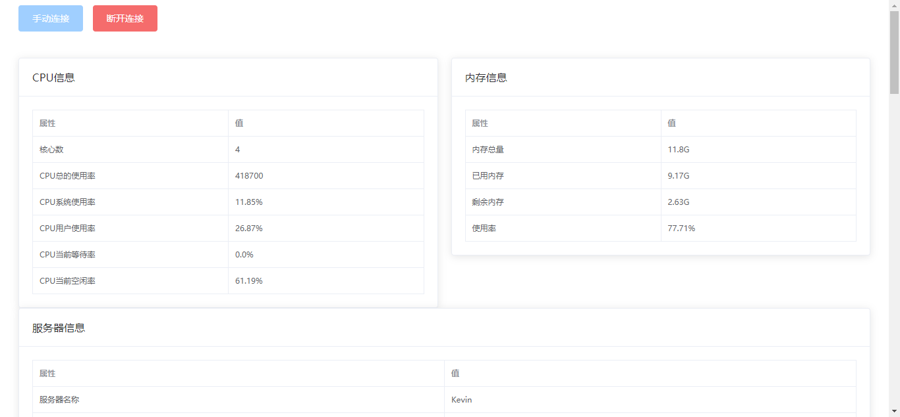

# SpringBoot-WebSocket

> 此 demo 主要演示了 SpringBoot 如何集成 WebSocket，实现后端主动往前端推送数据。网上大部分websocket的例子都是聊天室，本例主要是推送服务器状态信息。前端页面基于vue和element-ui实现。

> 学习：https://github.com/xkcoding/spring-boot-demo/tree/master/demo-websocket

## 1. 运行方式

1. 启动 `SpringBootWebsocketApplication.java`
2. 访问 http://localhost:8080/server.html

## 2. 运行效果

## 3. 参考

### 3.1. 后端

1. Spring Boot 整合 Websocket 官方文档：https://docs.spring.io/spring/docs/5.2.12.RELEASE/spring-framework-reference/web.html#websocket
2. 服务器信息采集 oshi 使用：https://github.com/oshi/oshi

### 3.2. 前端

1. vue.js 语法：https://cn.vuejs.org/v2/guide/
2. element-ui 用法：http://element-cn.eleme.io/#/zh-CN
3. stomp.js 用法：https://github.com/jmesnil/stomp-websocket
4. sockjs 用法：https://github.com/sockjs/sockjs-client
5. axios.js 用法：https://github.com/axios/axios#example
